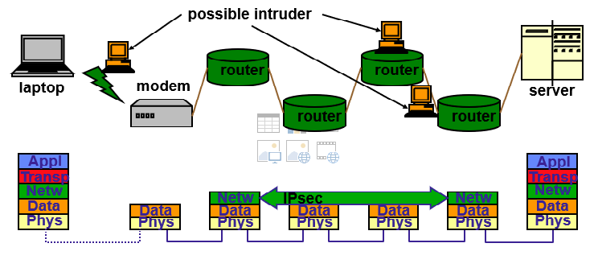
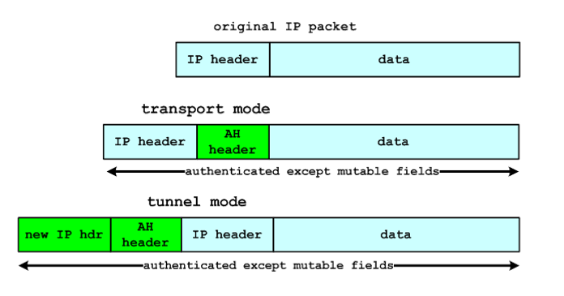
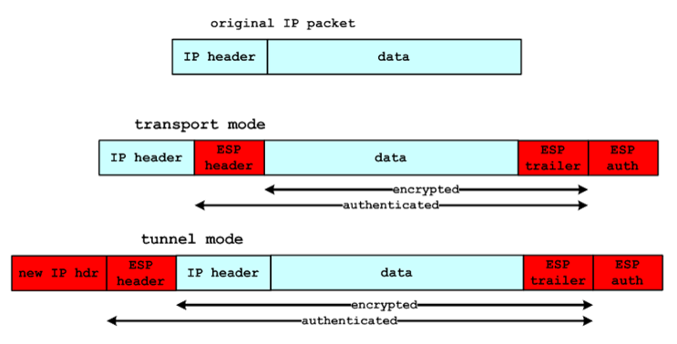
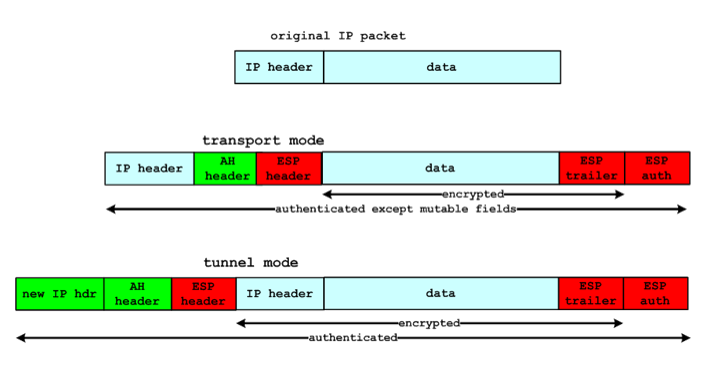
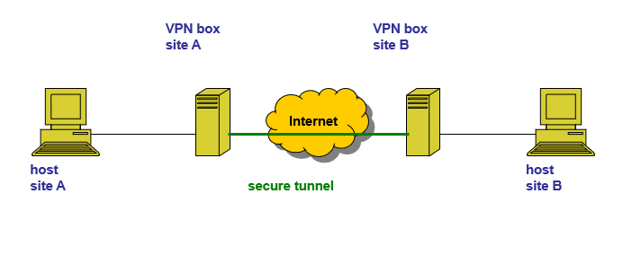

# IPSec

## Netwerklaagbeveiliging
##### Mogelijke bedreigingen
* Pakketten meermaals versturen (replay packets)
* IP-adres wijzigen (source spoofing)
* Geen dataintegriteit of confidentialiteit.
* Vervalste routeinformatie kan verzonden worden.

IPSec is een netwerklaagprotocol dat:

* veilige IP verbindingen maakt.
* applicatieonafhankelijk is.

## Toepassingen
##### LAN-to-LAN
Deze methode zal verspreide netwerken (op geografisch verschillende locaties) veilig verbinden zodat het één lokaal netwerk lijkt. 

##### Client-to-LAN
Hier zet de client zelf een IPSec verbinding op, alsof het lijkt dat hij deel uitmaakt van het lokaal subnetwerk. 

## Voordelen/nadelen
##### Voordelen
* Applicatieonafhankelijk. Het biedt dus ook beveiliging voor applicaties die zelf geen beveiliging voorzien.
* Beveiligingsmechanismen moeten maar gelden op beperkt aantal systemen (firewall of router). Het interne verkeer wordt hierdoor niet beïnvloedt.
* Eindgebruikers moeten zich hier niets van aantrekken.
##### Nadelen
* Er is geen beveiliging nadat het bericht de gateway heeft gepasseerd.
* Systeemresources zijn nodig om cryptographische functies te berekenen.
* De implementatie is vrij complex en het gebeurt vaak dat verschillende versies incompatibel zijn met elkaar.

## Ipsec modi
##### Layer 2 tunnel mode (default)
* Bescherming van interne routinggegevens door heel het pakket te encrypteren en een nieuwe IP header eraan toe te voegen. 
* Geschikt voor **network-to-network** (tussen 2 verschillende routers op verschillende locaties), **host-to-network** (remote user access) en **host-to-host** communicatie (private chat).
##### Transport mode
* Enkel de payload wordt geëncrypteerd, de IP header blijft ongewijzigd.
* Geschikt voor **end-to-end** communicatie tussen toestellen met publieke IP adressen.

## Ipsec protocollen
Ipsec maakt gebruik van twee protocollen: **Authentication Header (AH)** en **Encapsulationg Security Payload (ESP)**
##### Authentication Header

* Biedt **authenticatie** en **dataintegriteit**.
* Voorkomt IP spoofing en replay mechanismen.

Werking:
1. De IP header en data payload worden gehasht met een **one-way hashfunctie**.
1. De returnwaarde van deze hashfunctie wordt gebruikt om een nieuwe **authentication header** te maken, die toegevoegd wordt aan het originele pakket.
1. Het pakket wordt doorgestuurd naar de IPSec router van de begunstigde.
1. Deze router zal de IP header en data opnieuw hashen, en vergelijkt deze met de **authentication header**. Indien deze verschillend zijn, wil dit zeggen dat het pakket is aangepast.

##### Encapsulating Security Payload

* Biedt **confidentialiteit**, **data origin authentication** en **integriteit**.
* Voorkomt replay mechanismen en beperkte traffic-flow confidentialiteit.

Werking:
1. ESP maakt gebruik van een confidentialiteitsfunctie. De data (en optioneel de IP header) wordt geëncrypteerd met een traditioneel algoritme (**AES-128-CBC**, **AES-GCM**, ...). 
1. Optioneel wordt er ook geauthenticeerd, gebruik makend van dezelde methoden als bij de authentication header. 

In **transport** mode biedt ESP **encryptie** en **authenticatie**, maar geen **traffic flow confidentiality**.

in **tunnel** mode biedt het wel **traffic flow confidentiality**. Een aanvaller kan enkel zien naar welk lokaal netwerk een pakket werd verstuurd, maar weet niet naar welk specifiek toestal van dit netwerk het verstuurd werd.

# VPN

VPN is een beveiligde tunnel van site tot site.

Voorbeelden:

* **IPsec**
* **PPTP** (Point-to-Point Tunneling Protocol)
* **L2TP** (Layer 2 Tunneling Protocol)
* **SSL/TLS**
* **SSH**
* **SSTP** (Secure Socket Tunneling Protocol)

## IPsec
##### Voordelen
* Ontworpen voor dit probleem.
* Wordt gebruikt in andere VPN oplossingen.
##### Nadelen
* Complexiteit van het IPSec protocol.
* Veroorzaakt problemen met NAT en firewalls.
## PPTP
##### Voordelen
* Snel.
* Heel gemakkelijk om te configureren.
##### Nadelen
* Helemaal niet veilig.
* NSA luistert berichten af.
## OpenVPN
##### Voordelen
* Veel configuratiemogelijkheden.
* Heel veilig.
* Kan firewalls omzeilen.
* Breed aanbod aan encryptiealgoritmen.
* Open source.
##### Nadelen
* Third party software noodzakelijk.
* Kan moeilijk te configureren zijn.
* Beveiligd de transportlaag i.p.v. de netwerklaag.

## L2TP/IPsec
L2TP biedt zelf geen encryptie or confidentialiteit. Het combineert zich daarom met IPsec.
##### Voordelen
* Heel veilig.
* Makkelijk configureerbaar.
* Beschikbaar op moderne platformen.
##### Nadelen
* Kans bestaat dat NSA berichten leest.
* Trager dan OpenVPN.
* Heeft moeilijkheden met strenge firewalls.
